# clash-tracker

## 💎 __Installation de clash-tracker__

### Faite npm i

## 🔨 __Configuration de clash-tracker__

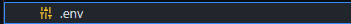

### Rendez vous sur le site https://developer.clashofclans.com/#/

#### Vous devez être arriver sur une page comme indiqué ci-dessous

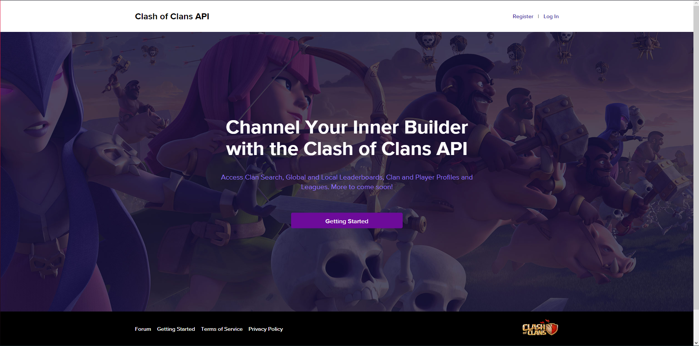

###  Allez dans l'onglet register sur le site

#### Vous devez être arriver sur une page comme indiqué ci-dessous
#### Puis créer votre compte en suivant toute les étapes indiqué à la lettre sur le site

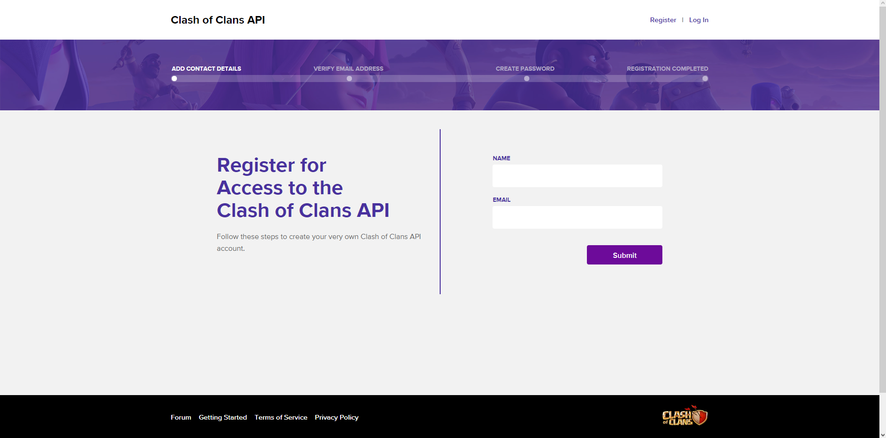

### Une fois votre compte créer allez dans l'onglet Log In puis connectez vous a votre compte que vous avez créer

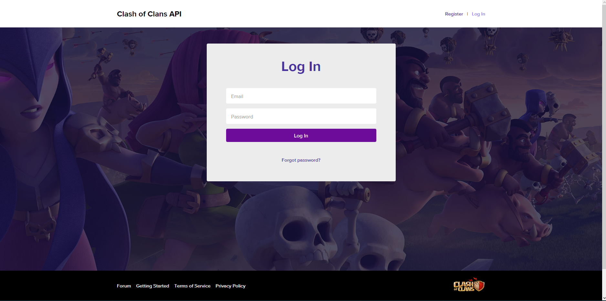

### Une fois connecter allez dans l'onget My Account

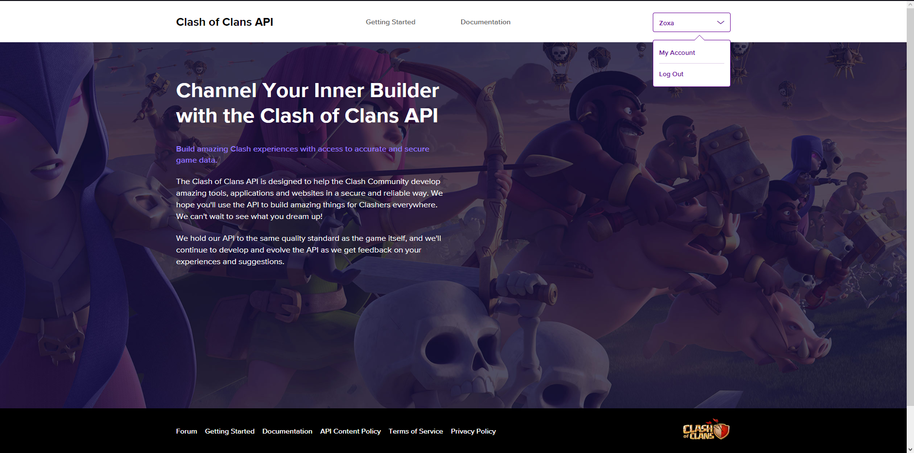

#### Vous devez être arriver sur une page comme indiqué ci-dessous

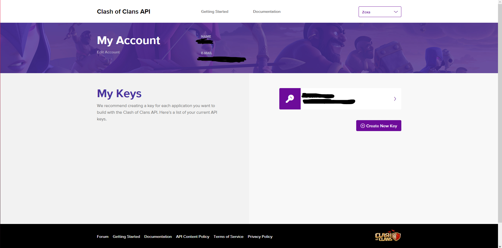

### Puis créer une nouvelle clé en cliquant sur Create New Key

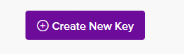

### Créer votre nouvelle clé en faisant comme indiqué ci-dessous

### Revenez sur My Account

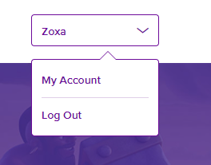

### Vous devez voir votre nouvelle clé créer comme ci-dessous

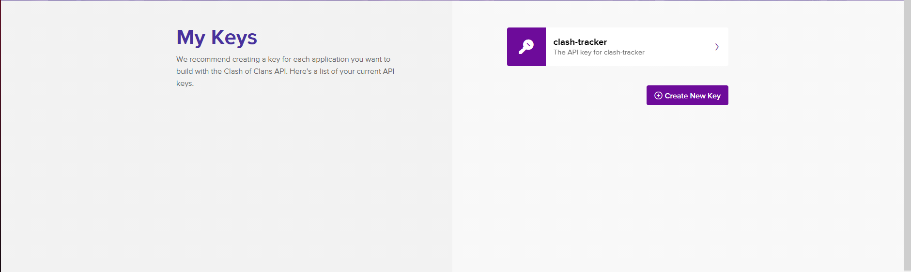

## 📌 __Utilisation de clash-tracker__

### Retourner dans votre code et aller dans le fichier .env comme ceci

#### Ecrivez y `TOKEN=votre token que vous avez copier dans l'etape de avant`

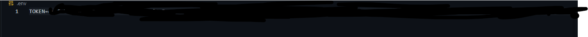

### Ensuite aller dans le fichier main.js

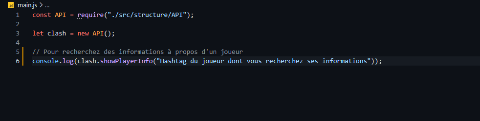

#### Et configurer ^^ puis utilisez

#### Des nouveautés à venir sur l'API dans les semaines à venir ^^ je garde secret les news pour le moment ^^